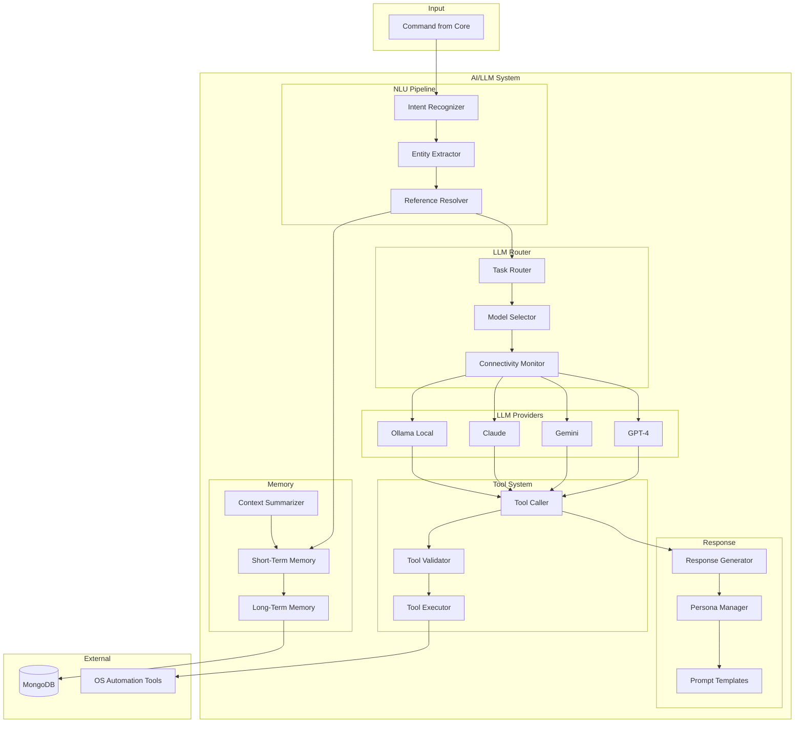

# Design Document: Dev AI/LLM Integration System

## Overview

The AI/LLM Integration System is the intelligence layer of Dev, providing natural language understanding, hybrid LLM routing, tool calling, conversation memory, and response generation. It uses LangChain for orchestration, supporting both cloud LLMs (GPT-4, Gemini, Claude) and local models (Ollama/LLaMA) with automatic fallback.

## Architecture



## Components and Interfaces

### 1. Intent Recognizer

Extracts intent from natural language commands.

```typescript
interface Intent {
  name: string;
  confidence: number;
  category: string;
}

interface IntentResult {
  intents: Intent[];
  selectedIntent: Intent;
  isAmbiguous: boolean;
  clarificationNeeded?: string;
}

interface IntentPattern {
  intent: string;
  patterns: string[];
  synonyms: Map<string, string[]>;
}

interface IntentRecognizer {
  recognize(text: string, context?: ConversationContext): Promise<IntentResult>;
  normalizeCommand(text: string): string;
  addPattern(pattern: IntentPattern): void;
  getSynonyms(word: string): string[];
}

// Intent normalization mapping
const INTENT_SYNONYMS: Map<string, string> = new Map([
  ['open', 'OPEN_APP'],
  ['launch', 'OPEN_APP'],
  ['start', 'OPEN_APP'],
  ['run', 'OPEN_APP'],
  ['close', 'CLOSE_APP'],
  ['quit', 'CLOSE_APP'],
  ['exit', 'CLOSE_APP'],
  // ... more mappings
]);
```

### 2. Entity Extractor

Extracts entities (parameters) from commands.

```typescript
interface Entity {
  type: string;
  value: string;
  confidence: number;
  startIndex: number;
  endIndex: number;
}

interface EntityResult {
  entities: Entity[];
  rawText: string;
}

interface EntityExtractor {
  extract(text: string, intent: Intent): Promise<EntityResult>;
  getEntityTypes(): string[];
}
```

### 3. Reference Resolver

Resolves pronouns and references using context.

```typescript
interface Reference {
  pronoun: string;
  resolvedValue: string;
  confidence: number;
}

interface ReferenceResolver {
  resolve(text: string, context: ConversationContext): Promise<string>;
  findReferences(text: string): string[];
  getResolution(pronoun: string, context: ConversationContext): Reference | null;
}
```

### 4. Task Router & Model Selector

Routes tasks to appropriate LLM based on task type and connectivity.

```typescript
type TaskComplexity = 'simple' | 'moderate' | 'complex';
type TaskType = 'greeting' | 'confirmation' | 'reasoning' | 'coding' | 'general';

interface TaskClassification {
  type: TaskType;
  complexity: TaskComplexity;
  requiresInternet: boolean;
}

interface ModelConfig {
  name: string;
  provider: 'openai' | 'google' | 'anthropic' | 'ollama';
  isLocal: boolean;
  capabilities: string[];
  maxTokens: number;
}

interface RoutingDecision {
  model: ModelConfig;
  reason: string;
  timestamp: Date;
}

interface TaskRouter {
  classifyTask(intent: Intent, entities: Entity[]): TaskClassification;
}

interface ModelSelector {
  selectModel(task: TaskClassification, isOnline: boolean): RoutingDecision;
  getAvailableModels(): ModelConfig[];
  logRoutingDecision(decision: RoutingDecision): void;
}
```

### 5. Tool Caller

Generates and validates tool calls from LLM output.

```typescript
interface ToolSchema {
  name: string;
  description: string;
  parameters: JSONSchema;
  requiredPermissions: string[];
}

interface ToolCall {
  id: string;
  name: string;
  parameters: Record<string, any>;
  timestamp: Date;
}

interface ToolResult {
  callId: string;
  success: boolean;
  output: any;
  error?: string;
}

interface ToolCaller {
  parseToolCall(llmOutput: string): ToolCall | null;
  validateParameters(call: ToolCall, schema: ToolSchema): ValidationResult;
  execute(call: ToolCall): Promise<ToolResult>;
  retry(call: ToolCall, error: string): Promise<ToolCall>;
  serializeToolCall(call: ToolCall): string;
  deserializeToolCall(json: string): ToolCall;
}

interface ValidationResult {
  valid: boolean;
  errors: string[];
}
```

### 6. Conversation Memory

Manages short-term and long-term conversation context.

```typescript
interface Message {
  role: 'user' | 'assistant' | 'system';
  content: string;
  timestamp: Date;
  metadata?: Record<string, any>;
}

interface ConversationContext {
  sessionId: string;
  userId: string;
  messages: Message[];
  entities: Map<string, Entity>;
  tokenCount: number;
}

interface MemoryConfig {
  maxTokens: number;
  summarizationThreshold: number;
}

interface ConversationMemory {
  addMessage(sessionId: string, message: Message): void;
  getContext(sessionId: string): ConversationContext;
  summarize(context: ConversationContext): Promise<ConversationContext>;
  persist(context: ConversationContext): Promise<void>;
  loadHistory(userId: string, limit: number): Promise<Message[]>;
  getTokenCount(context: ConversationContext): number;
}
```

### 7. Context Summarizer

Summarizes conversation history when it exceeds token limits.

```typescript
interface SummaryResult {
  summary: string;
  originalTokens: number;
  summaryTokens: number;
  messagesRemoved: number;
}

interface ContextSummarizer {
  shouldSummarize(context: ConversationContext, maxTokens: number): boolean;
  summarize(context: ConversationContext): Promise<SummaryResult>;
  preserveRecentMessages(context: ConversationContext, count: number): Message[];
}
```

### 8. Response Generator

Generates responses with persona and language support.

```typescript
interface ResponseConfig {
  language: 'en' | 'hi';
  persona: PersonaConfig;
  includeToolResults: boolean;
}

interface PersonaConfig {
  name: string;
  personality: string;
  tone: string;
  systemPrompt: string;
}

interface GeneratedResponse {
  text: string;
  language: string;
  tokensUsed: number;
  modelUsed: string;
}

interface ResponseGenerator {
  generate(
    context: ConversationContext,
    toolResults: ToolResult[],
    config: ResponseConfig
  ): Promise<GeneratedResponse>;
  
  applyPersona(prompt: string, persona: PersonaConfig): string;
  formatForLanguage(text: string, language: string): string;
}
```

### 9. Prompt Template Manager

Manages versioned prompt templates.

```typescript
interface PromptTemplate {
  id: string;
  name: string;
  version: string;
  content: string;
  variables: string[];
  createdAt: Date;
  updatedAt: Date;
}

interface TemplateVariables {
  userName?: string;
  context?: string;
  tools?: ToolSchema[];
  language?: string;
  [key: string]: any;
}

interface PromptTemplateManager {
  getTemplate(name: string): PromptTemplate;
  renderTemplate(template: PromptTemplate, variables: TemplateVariables): string;
  updateTemplate(name: string, content: string): PromptTemplate;
  getDefaultTemplate(name: string): PromptTemplate;
  validateTemplate(template: PromptTemplate): boolean;
  serializeTemplate(template: PromptTemplate): string;
  deserializeTemplate(json: string): PromptTemplate;
}
```

## Data Models

### MongoDB Schemas

```typescript
// Conversation History Schema
interface ConversationDocument {
  _id: ObjectId;
  userId: ObjectId;
  sessionId: string;
  messages: Message[];
  summary?: string;
  createdAt: Date;
  updatedAt: Date;
}

// Routing Log Schema
interface RoutingLogDocument {
  _id: ObjectId;
  taskType: string;
  complexity: string;
  modelSelected: string;
  reason: string;
  isOnline: boolean;
  timestamp: Date;
}

// Prompt Template Schema
interface PromptTemplateDocument {
  _id: ObjectId;
  name: string;
  version: string;
  content: string;
  variables: string[];
  isDefault: boolean;
  createdAt: Date;
  updatedAt: Date;
}
```

## Correctness Properties

*A property is a characteristic or behavior that should hold true across all valid executions of a system-essentially, a formal statement about what the system should do. Properties serve as the bridge between human-readable specifications and machine-verifiable correctness guarantees.*

### Property 1: Highest Confidence Intent Selection
*For any* command with multiple matching intents, the system SHALL select the intent with the highest confidence score.
**Validates: Requirements 1.2**

### Property 2: Low Confidence Clarification
*For any* intent recognition result with confidence below 70%, the system SHALL return a clarification request rather than proceeding with execution.
**Validates: Requirements 1.3**

### Property 3: Intent Synonym Normalization
*For any* set of synonym commands (e.g., "open", "launch", "start"), the intent recognizer SHALL map them to the same canonical intent.
**Validates: Requirements 1.4**

### Property 4: Connectivity-Based Model Routing
*For any* task, when internet is available the system SHALL route complex tasks to cloud LLMs, and when unavailable SHALL fall back to local Ollama models.
**Validates: Requirements 2.1, 2.2**

### Property 5: Code Task Model Selection
*For any* task classified as code generation, the system SHALL select a coding-optimized model (GPT-4 or Claude).
**Validates: Requirements 2.3**

### Property 6: Simple Task Local Routing
*For any* simple task (greetings, confirmations), the system SHALL route to lightweight local models regardless of connectivity.
**Validates: Requirements 2.4**

### Property 7: Routing Decision Logging
*For any* model selection, the system SHALL create a log entry containing the selected model, task type, and reason.
**Validates: Requirements 2.5**

### Property 8: Tool Parameter Validation Before Execution
*For any* tool call, the system SHALL validate parameters against the tool schema BEFORE executing the tool.
**Validates: Requirements 3.2**

### Property 9: Tool Result Incorporation
*For any* successful tool execution, the result SHALL be included in the context for response generation.
**Validates: Requirements 3.3**

### Property 10: Tool Call Serialization Round-Trip
*For any* ToolCall object, serializing to JSON and deserializing back SHALL produce an equivalent object.
**Validates: Requirements 3.5**

### Property 11: Context History Inclusion
*For any* message processing with existing conversation history, the relevant history SHALL be included in the prompt context.
**Validates: Requirements 4.1**

### Property 12: Context Token Limit Enforcement
*For any* conversation context exceeding the model's token limit, the system SHALL summarize older messages to fit within the limit.
**Validates: Requirements 4.2**

### Property 13: Pronoun Reference Resolution
*For any* command containing pronouns ("it", "that", "this") with resolvable context, the system SHALL substitute the pronoun with the resolved entity.
**Validates: Requirements 4.3**

### Property 14: History Persistence Fields
*For any* persisted conversation history, the document SHALL contain userId and sessionId fields.
**Validates: Requirements 4.4**

### Property 15: Persona Prompt Application
*For any* response generation, the Dev persona system prompt SHALL be included in the LLM prompt.
**Validates: Requirements 5.1**

### Property 16: Language-Appropriate Response
*For any* response generation with specified language (English or Hindi), the output text SHALL be in the requested language.
**Validates: Requirements 5.2, 5.3**

### Property 17: Template Variable Injection
*For any* prompt template with variables, rendering SHALL substitute all variable placeholders with provided values.
**Validates: Requirements 6.3**

### Property 18: Invalid Template Fallback
*For any* invalid prompt template, the system SHALL fall back to the default template and log an error.
**Validates: Requirements 6.4**

### Property 19: Template Serialization Round-Trip
*For any* PromptTemplate object, serializing to JSON and deserializing back SHALL produce an equivalent template with version metadata preserved.
**Validates: Requirements 6.5**

## Error Handling

| Error Type | Handling Strategy |
|------------|-------------------|
| Intent not recognized | Return clarification request |
| Low confidence | Ask clarifying question |
| Model unavailable | Fall back to alternative model |
| Token limit exceeded | Summarize context and retry |
| Tool validation failed | Return specific validation errors |
| Tool execution failed | Retry once, then report failure |
| Template not found | Use default template |
| Network timeout | Switch to local model |

## Testing Strategy

### Property-Based Testing Library
- **TypeScript**: fast-check

### Unit Tests
- Intent synonym mapping
- Entity extraction patterns
- Token counting
- Template variable substitution
- Model selection logic

### Property-Based Tests
Each correctness property above will be implemented as a property-based test using fast-check:
- Generate random valid inputs (commands, intents, contexts, templates)
- Verify the property holds across 100+ iterations
- Tag each test with: `**Feature: dev-ai-llm, Property {N}: {description}**`

### Integration Tests
- End-to-end intent recognition
- Multi-turn conversation handling
- Tool calling flows
- Model fallback scenarios
- Context summarization
