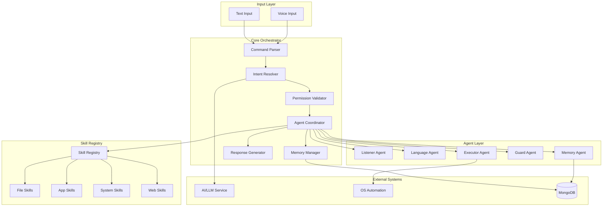

# Design Document: Dev Assistant Core

## Overview

The Core Orchestration Layer is the central brain of the Dev AI Assistant, responsible for coordinating all subsystems including voice processing, AI/LLM, OS automation, and the frontend. It implements a multi-agent architecture using LangChain for agent coordination, with a command processing pipeline that handles intent extraction, permission validation, skill routing, and response generation.

## Architecture



## Components and Interfaces

### 1. Command Parser

Receives raw input (voice transcription or text) and normalizes it for processing.

```typescript
interface CommandParser {
  parse(input: RawInput): ParsedCommand;
}

interface RawInput {
  type: 'voice' | 'text';
  content: string;
  timestamp: Date;
  userId: string;
  sessionId: string;
}

interface ParsedCommand {
  id: string;
  rawText: string;
  normalizedText: string;
  language: 'en' | 'hi' | 'hinglish';
  metadata: CommandMetadata;
}
```

### 2. Intent Resolver

Extracts intent and entities from parsed commands using LLM.

```typescript
interface IntentResolver {
  resolve(command: ParsedCommand, context: ConversationContext): Promise<ResolvedIntent>;
}

interface ResolvedIntent {
  intent: string;
  confidence: number;
  entities: Entity[];
  requiredSkills: string[];
  requiredPermissions: Permission[];
  isAmbiguous: boolean;
  clarificationNeeded?: string;
}

interface Entity {
  type: string;
  value: string;
  confidence: number;
}
```

### 3. Permission Validator

Validates commands against user's granted permissions.

```typescript
interface PermissionValidator {
  validate(intent: ResolvedIntent, userPermissions: Permission[]): ValidationResult;
}

interface ValidationResult {
  allowed: boolean;
  missingPermissions: Permission[];
  requiresElevation: boolean;
}

type Permission = 
  | 'file:read' | 'file:write' | 'file:delete'
  | 'app:launch' | 'app:close'
  | 'system:volume' | 'system:brightness' | 'system:network'
  | 'input:keyboard' | 'input:mouse'
  | 'web:browse' | 'web:search';
```

### 4. Agent Coordinator

Orchestrates multi-agent execution using LangChain.

```typescript
interface AgentCoordinator {
  execute(intent: ResolvedIntent, context: ExecutionContext): Promise<ExecutionResult>;
  getAgentStatus(agentId: string): AgentStatus;
  cancelExecution(executionId: string): Promise<void>;
}

interface ExecutionContext {
  userId: string;
  sessionId: string;
  permissions: Permission[];
  conversationHistory: Message[];
  executionState?: ExecutionState;
}

interface ExecutionResult {
  success: boolean;
  output: any;
  agentResults: AgentResult[];
  error?: ExecutionError;
}

interface ExecutionState {
  executionId: string;
  currentStep: number;
  totalSteps: number;
  completedAgents: string[];
  pendingAgents: string[];
  intermediateResults: Map<string, any>;
}
```

### 5. Memory Manager

Handles short-term and long-term memory operations.

```typescript
interface MemoryManager {
  storeShortTerm(sessionId: string, context: ConversationContext): void;
  storeLongTerm(userId: string, memory: LongTermMemory): Promise<void>;
  retrieveContext(userId: string, query: string): Promise<RelevantContext>;
  forget(userId: string, memoryId: string): Promise<void>;
}

interface ConversationContext {
  sessionId: string;
  messages: Message[];
  entities: Map<string, Entity>;
  lastIntent: ResolvedIntent;
}

interface LongTermMemory {
  id: string;
  userId: string;
  type: 'preference' | 'fact' | 'interaction';
  content: string;
  embedding?: number[];
  createdAt: Date;
}

interface Message {
  role: 'user' | 'assistant';
  content: string;
  timestamp: Date;
  intent?: string;
}
```

### 6. Skill Registry

Manages plugin-based skill system.

```typescript
interface SkillRegistry {
  register(manifest: SkillManifest): RegistrationResult;
  unregister(skillId: string): void;
  getSkill(skillId: string): Skill | null;
  listSkills(): SkillMetadata[];
  matchSkill(intent: string): Skill[];
}

interface SkillManifest {
  id: string;
  name: string;
  version: string;
  description: string;
  triggerPatterns: string[];
  requiredPermissions: Permission[];
  handler: string;
  schema: JSONSchema;
}

interface Skill {
  manifest: SkillManifest;
  execute(params: any, context: ExecutionContext): Promise<SkillResult>;
}

interface RegistrationResult {
  success: boolean;
  skillId?: string;
  errors?: ValidationError[];
}
```

### 7. Response Generator

Formats and generates responses in the Dev persona.

```typescript
interface ResponseGenerator {
  generate(result: ExecutionResult, context: ResponseContext): Promise<Response>;
}

interface ResponseContext {
  language: 'en' | 'hi';
  outputFormat: 'text' | 'speech' | 'both';
  persona: PersonaConfig;
}

interface Response {
  text: string;
  speechText?: string;
  emotion: 'neutral' | 'happy' | 'concerned' | 'thinking';
  suggestions?: string[];
}

interface PersonaConfig {
  name: string;
  personality: string;
  voiceStyle: string;
}
```

## Data Models

### Command Log

```typescript
interface CommandLog {
  id: string;
  userId: string;
  sessionId: string;
  command: ParsedCommand;
  intent: ResolvedIntent;
  result: ExecutionResult;
  response: Response;
  timestamp: Date;
  duration: number;
}
```

### User Session

```typescript
interface UserSession {
  sessionId: string;
  userId: string;
  startedAt: Date;
  lastActivityAt: Date;
  context: ConversationContext;
  activeExecutions: string[];
}
```

## Correctness Properties

*A property is a characteristic or behavior that should hold true across all valid executions of a system-essentially, a formal statement about what the system should do. Properties serve as the bridge between human-readable specifications and machine-verifiable correctness guarantees.*

### Property 1: Context Serialization Round-Trip
*For any* valid ConversationContext object, serializing to JSON and deserializing back SHALL produce an equivalent object with all fields preserved.
**Validates: Requirements 3.5**

### Property 2: Permission Enforcement Invariant
*For any* command and user permission set, if the command requires permissions not in the user's set, the system SHALL reject execution and return the specific missing permissions.
**Validates: Requirements 1.4, 1.5, 4.3**

### Property 3: Intent Resolution Consistency
*For any* unambiguous command, the Intent Resolver SHALL produce the same intent classification when given the same input and context.
**Validates: Requirements 1.1**

### Property 4: Ambiguous Command Handling
*For any* command classified as ambiguous (confidence < 70%), the system SHALL return a clarification request rather than executing.
**Validates: Requirements 1.2**

### Property 5: Context Reference Resolution
*For any* command containing pronoun references and a conversation history containing the referent, the system SHALL correctly resolve the reference to the appropriate entity.
**Validates: Requirements 1.3**

### Property 6: Multi-Skill Decomposition
*For any* command requiring multiple skills, the Agent Coordinator SHALL produce a valid execution sequence where each skill's dependencies are satisfied before execution.
**Validates: Requirements 2.1**

### Property 7: Execution State Persistence
*For any* interrupted multi-step execution, the execution state SHALL be preserved such that resumption continues from the correct step without re-executing completed steps.
**Validates: Requirements 2.5**

### Property 8: Agent Failure Isolation
*For any* agent failure during execution, the failure SHALL be contained and reported without crashing the orchestrator or affecting other concurrent executions.
**Validates: Requirements 2.3**

### Property 9: Short-Term Memory Storage
*For any* conversation message, after storage in short-term memory, retrieval within the same session SHALL return the stored message.
**Validates: Requirements 3.1**

### Property 10: Memory Deletion Completeness
*For any* forget request, after deletion, the specified memory SHALL not be retrievable from any memory store.
**Validates: Requirements 3.4**

### Property 11: Valid Plugin Registration
*For any* well-formed SkillManifest, registration SHALL succeed and the skill SHALL be retrievable from the registry.
**Validates: Requirements 4.1**

### Property 12: Malformed Plugin Rejection
*For any* malformed SkillManifest (missing required fields, invalid schema), registration SHALL fail with specific validation errors.
**Validates: Requirements 4.5**

### Property 13: Skill Listing Completeness
*For any* set of registered skills, listing SHALL return all registered skills with their complete metadata.
**Validates: Requirements 4.4**

### Property 14: Language-Appropriate Response
*For any* response generation with a specified language preference, the output text SHALL be in the requested language.
**Validates: Requirements 5.1**

### Property 15: Response Format Support
*For any* response, the system SHALL be able to generate both text and speech-optimized formats.
**Validates: Requirements 5.4**

## Error Handling

| Error Type | Handling Strategy |
|------------|-------------------|
| Intent extraction failure | Return clarification request with suggestions |
| Permission denied | Return specific permission needed, offer to request |
| Agent timeout | Cancel execution, return partial results if available |
| Agent crash | Isolate failure, log error, notify user gracefully |
| Memory storage failure | Retry with exponential backoff, fall back to in-memory |
| Skill not found | Suggest similar skills, offer to search |
| Invalid plugin | Reject with detailed validation errors |

## Testing Strategy

### Property-Based Testing Library
- **TypeScript**: fast-check

### Unit Tests
- Command parser normalization
- Intent entity extraction
- Permission set operations
- Skill manifest validation
- Response formatting

### Property-Based Tests
Each correctness property above will be implemented as a property-based test using fast-check:
- Generate random valid inputs
- Verify the property holds across 100+ iterations
- Tag each test with: `**Feature: dev-assistant-core, Property {N}: {description}**`

### Integration Tests
- End-to-end command processing pipeline
- Multi-agent coordination scenarios
- Memory persistence and retrieval
- Skill registration and invocation
