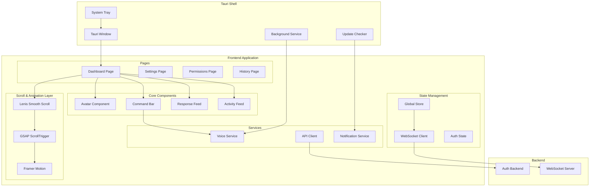

# Design Document: Dev Frontend UI System

## Overview

The Frontend UI System provides the visual interface for Dev, including a Next.js web dashboard and Tauri desktop application. It features an animated Dev character avatar, command input (voice/text), response display, settings management, permission controls, and real-time activity feed. The UI uses Tailwind CSS, Framer Motion for animations, Three.js/R3F for 3D avatar rendering, and Lenis + GSAP ScrollTrigger for ultra-smooth scrolling and scroll-based animations.

## Scrolling & Animation Architecture

### Design Decision: Lenis + GSAP ScrollTrigger

We chose Lenis + GSAP ScrollTrigger as the scrolling foundation for the following reasons:

1. **Lenis** - Ultra-smooth, momentum-based scrolling
   - Lightweight and modern (replaces heavier Locomotive Scroll)
   - RequestAnimationFrame-based for 60fps performance
   - Natural inertia scrolling on both touch and wheel
   - Clean API with minimal overhead

2. **GSAP ScrollTrigger** - Professional-grade scroll animations
   - Industry standard (used by Apple, Nike, Google)
   - Precise control over scroll progress
   - Timeline-based animations with scrubbing
   - Pinning sections and parallax effects

This combination delivers butter-smooth scrolling with frame-perfect parallax and full animation control at production-level performance.

## Architecture



## Components and Interfaces

### 1. Avatar Component

Animated Dev character with state-based animations.

```typescript
type AvatarState = 'idle' | 'listening' | 'speaking' | 'processing' | 'error';

interface AvatarProps {
  state: AvatarState;
  emotion?: 'neutral' | 'happy' | 'concerned' | 'thinking';
  size?: 'small' | 'medium' | 'large';
  onAnimationComplete?: () => void;
}

interface AvatarAnimations {
  idle: AnimationConfig;
  listening: AnimationConfig;
  speaking: AnimationConfig;
  processing: AnimationConfig;
  error: AnimationConfig;
}

interface AnimationConfig {
  duration: number;
  loop: boolean;
  keyframes: Keyframe[];
}

// Avatar state machine
interface AvatarStateMachine {
  currentState: AvatarState;
  transition(newState: AvatarState): void;
  getAnimation(state: AvatarState): AnimationConfig;
}
```

### 2. Command Bar

Input interface for voice and text commands.

```typescript
interface CommandBarProps {
  onSubmit: (command: string) => void;
  onVoiceStart: () => void;
  onVoiceEnd: () => void;
  isVoiceActive: boolean;
  placeholder?: string;
  disabled?: boolean;
}

interface CommandBarState {
  inputValue: string;
  isVoiceMode: boolean;
  historyIndex: number;
}

interface CommandHistory {
  commands: string[];
  maxSize: number;
  add(command: string): void;
  getPrevious(): string | null;
  getNext(): string | null;
  clear(): void;
}

interface VoiceIndicator {
  isActive: boolean;
  amplitude: number;
  render(): JSX.Element;
}
```

### 3. Response Feed

Chat-style display for Dev's responses.

```typescript
interface Message {
  id: string;
  role: 'user' | 'assistant';
  content: string;
  timestamp: Date;
  status: 'pending' | 'complete' | 'error';
  metadata?: MessageMetadata;
}

interface MessageMetadata {
  hasCode: boolean;
  hasStructuredData: boolean;
  isLong: boolean;
  language?: string;
}

interface ResponseFeedProps {
  messages: Message[];
  onMessageClick?: (id: string) => void;
  isLoading?: boolean;
}

interface CodeBlockProps {
  code: string;
  language: string;
  showLineNumbers?: boolean;
}

interface StructuredDataProps {
  data: Record<string, any> | any[];
  format: 'table' | 'card' | 'list';
}

interface CollapsibleSectionProps {
  title: string;
  content: string;
  defaultExpanded?: boolean;
}
```

### 4. Activity Feed

Real-time command execution history.

```typescript
interface ActivityEntry {
  id: string;
  command: string;
  intent: string;
  status: 'pending' | 'success' | 'failed' | 'cancelled';
  result?: any;
  error?: string;
  timestamp: Date;
  duration?: number;
}

interface ActivityFeedProps {
  entries: ActivityEntry[];
  onEntryClick: (id: string) => void;
  filters: ActivityFilters;
  onFilterChange: (filters: ActivityFilters) => void;
}

interface ActivityFilters {
  dateRange?: { start: Date; end: Date };
  status?: string[];
  type?: string[];
}

interface ActivityEntryProps {
  entry: ActivityEntry;
  isExpanded: boolean;
  onToggle: () => void;
}
```

### 5. Settings Panel

User preferences management.

```typescript
interface UserPreferences {
  language: 'en' | 'hi';
  theme: 'light' | 'dark' | 'system';
  voiceEnabled: boolean;
  voiceId: string;
  voiceSpeed: number;
  wakeWord: string;
  notifications: NotificationSettings;
}

interface NotificationSettings {
  sound: boolean;
  desktop: boolean;
  commandComplete: boolean;
  errors: boolean;
}

interface SettingsPanelProps {
  preferences: UserPreferences;
  onPreferenceChange: (key: string, value: any) => void;
  onSave: () => void;
  isSaving: boolean;
}

interface SettingsCategory {
  id: string;
  label: string;
  icon: string;
  settings: SettingItem[];
}

interface SettingItem {
  key: string;
  label: string;
  type: 'toggle' | 'select' | 'slider' | 'text';
  options?: { value: string; label: string }[];
  validation?: (value: any) => boolean;
}
```

### 6. Permission Panel

OS permission management UI.

```typescript
interface Permission {
  id: string;
  category: string;
  name: string;
  description: string;
  isGranted: boolean;
  grantedAt?: Date;
}

interface PermissionCategory {
  id: string;
  name: string;
  icon: string;
  permissions: Permission[];
}

interface PermissionPanelProps {
  categories: PermissionCategory[];
  onGrant: (permissionId: string) => void;
  onRevoke: (permissionId: string) => void;
}

interface PermissionModalProps {
  permission: Permission;
  isOpen: boolean;
  onGrant: () => void;
  onDeny: () => void;
  onClose: () => void;
}

interface PermissionExplanation {
  permissionId: string;
  title: string;
  description: string;
  examples: string[];
  risks: string[];
}
```

### 7. WebSocket Client

Real-time communication with backend.

```typescript
interface WSMessage {
  type: string;
  payload: any;
  timestamp: Date;
}

interface WebSocketClientConfig {
  url: string;
  reconnectInterval: number;
  maxReconnectAttempts: number;
}

interface WebSocketClient {
  connect(): Promise<void>;
  disconnect(): void;
  send(message: WSMessage): void;
  onMessage(handler: (message: WSMessage) => void): void;
  onConnectionChange(handler: (connected: boolean) => void): void;
  isConnected(): boolean;
}

interface ConnectionStatus {
  isConnected: boolean;
  isReconnecting: boolean;
  lastConnectedAt?: Date;
  reconnectAttempts: number;
}
```

### 8. Tauri Integration

Desktop-specific functionality.

```typescript
interface TauriWindow {
  minimize(): Promise<void>;
  maximize(): Promise<void>;
  close(): Promise<void>;
  hide(): Promise<void>;
  show(): Promise<void>;
  setAlwaysOnTop(value: boolean): Promise<void>;
}

interface SystemTray {
  setIcon(icon: string): Promise<void>;
  setMenu(items: TrayMenuItem[]): Promise<void>;
  onMenuItemClick(handler: (id: string) => void): void;
}

interface TrayMenuItem {
  id: string;
  label: string;
  enabled?: boolean;
  checked?: boolean;
}

interface UpdateChecker {
  checkForUpdates(): Promise<UpdateInfo | null>;
  downloadUpdate(): Promise<void>;
  installUpdate(): Promise<void>;
}

interface UpdateInfo {
  version: string;
  releaseNotes: string;
  downloadUrl: string;
  publishedAt: Date;
}

interface BackgroundService {
  startWakeWordListener(): Promise<void>;
  stopWakeWordListener(): Promise<void>;
  isListening(): boolean;
  onWakeWord(handler: () => void): void;
}
```

### 9. Global State Store

Application state management.

```typescript
interface AppState {
  user: User | null;
  preferences: UserPreferences;
  permissions: Permission[];
  messages: Message[];
  activities: ActivityEntry[];
  avatarState: AvatarState;
  isOnline: boolean;
  isVoiceActive: boolean;
}

interface AppActions {
  setUser(user: User | null): void;
  updatePreferences(prefs: Partial<UserPreferences>): void;
  addMessage(message: Message): void;
  addActivity(entry: ActivityEntry): void;
  updateActivity(id: string, updates: Partial<ActivityEntry>): void;
  setAvatarState(state: AvatarState): void;
  setOnlineStatus(isOnline: boolean): void;
}

type AppStore = AppState & AppActions;
```

### 10. Scroll & Animation Service

Lenis + GSAP ScrollTrigger integration for smooth scrolling and scroll-based animations.

```typescript
interface LenisConfig {
  duration?: number;           // Scroll duration (default: 1.2)
  easing?: (t: number) => number;  // Easing function
  orientation?: 'vertical' | 'horizontal';
  gestureOrientation?: 'vertical' | 'horizontal' | 'both';
  smoothWheel?: boolean;
  smoothTouch?: boolean;
  wheelMultiplier?: number;
  touchMultiplier?: number;
  infinite?: boolean;
}

interface ScrollService {
  // Lenis instance management
  init(config?: LenisConfig): void;
  destroy(): void;
  
  // Scroll control
  scrollTo(target: string | number | HTMLElement, options?: ScrollToOptions): void;
  stop(): void;
  start(): void;
  
  // GSAP ScrollTrigger integration
  registerScrollTrigger(): void;
  
  // Event handlers
  onScroll(callback: (e: ScrollEvent) => void): void;
  
  // State
  isScrolling(): boolean;
  getProgress(): number;
}

interface ScrollToOptions {
  offset?: number;
  duration?: number;
  easing?: (t: number) => number;
  immediate?: boolean;
  lock?: boolean;
  onComplete?: () => void;
}

interface ScrollEvent {
  scroll: number;
  limit: number;
  velocity: number;
  direction: 'up' | 'down';
  progress: number;
}

interface ScrollTriggerConfig {
  trigger: string | HTMLElement;
  start?: string;              // e.g., "top center"
  end?: string;                // e.g., "bottom center"
  scrub?: boolean | number;
  pin?: boolean | string;
  markers?: boolean;
  onEnter?: () => void;
  onLeave?: () => void;
  onEnterBack?: () => void;
  onLeaveBack?: () => void;
}

interface ParallaxConfig {
  element: string | HTMLElement;
  speed?: number;              // Parallax speed multiplier
  direction?: 'vertical' | 'horizontal';
  scrub?: boolean | number;
}

// Animation timeline with scroll control
interface ScrollTimeline {
  create(config: ScrollTriggerConfig): gsap.core.Timeline;
  addParallax(config: ParallaxConfig): void;
  addPinSection(element: string | HTMLElement, duration: string): void;
  addFadeIn(element: string | HTMLElement, config?: ScrollTriggerConfig): void;
  addSlideIn(element: string | HTMLElement, direction: 'left' | 'right' | 'up' | 'down'): void;
}
```

### Design Rationale: Scroll Animation Patterns

| Pattern | Use Case | Implementation |
|---------|----------|----------------|
| Smooth scroll | All page navigation | Lenis with 1.2s duration |
| Parallax backgrounds | Dashboard hero, settings header | GSAP ScrollTrigger with scrub |
| Pinned sections | Activity feed details, permission explanations | ScrollTrigger pin |
| Fade-in on scroll | Response messages, activity entries | ScrollTrigger + opacity tween |
| Progress indicators | Long response reading progress | Lenis scroll progress |

## Data Models

### Component Props Serialization

```typescript
// Activity entry JSON format
interface ActivityEntryJSON {
  id: string;
  command: string;
  intent: string;
  status: string;
  result?: any;
  error?: string;
  timestamp: string; // ISO 8601
  duration?: number;
}

// Parse activity from JSON
function parseActivityEntry(json: ActivityEntryJSON): ActivityEntry {
  return {
    ...json,
    timestamp: new Date(json.timestamp),
    status: json.status as ActivityEntry['status']
  };
}

// Serialize activity to JSON
function serializeActivityEntry(entry: ActivityEntry): ActivityEntryJSON {
  return {
    ...entry,
    timestamp: entry.timestamp.toISOString()
  };
}
```

## Correctness Properties

*A property is a characteristic or behavior that should hold true across all valid executions of a system-essentially, a formal statement about what the system should do. Properties serve as the bridge between human-readable specifications and machine-verifiable correctness guarantees.*

### Property 1: Avatar State-Animation Mapping
*For any* avatar state (idle, listening, speaking, processing, error), the avatar component SHALL display the corresponding animation for that state.
**Validates: Requirements 1.2, 1.3, 1.4, 1.5**

### Property 2: Voice Mode Activation
*For any* microphone button click, the command bar SHALL transition to voice input mode and display the voice indicator.
**Validates: Requirements 2.1, 2.3**

### Property 3: Text Command Submission
*For any* non-empty text input followed by Enter key press, the command SHALL be submitted and appear in the activity feed.
**Validates: Requirements 2.2, 2.4**

### Property 4: Command History Navigation
*For any* command history with entries, up/down arrow keys SHALL navigate through previous commands in order.
**Validates: Requirements 2.5**

### Property 5: Code Block Syntax Highlighting
*For any* response containing code blocks, the code SHALL be rendered with syntax highlighting appropriate to the language.
**Validates: Requirements 3.2**

### Property 6: Structured Data Formatting
*For any* response containing structured data (objects/arrays), the data SHALL be rendered as tables or cards, not raw JSON.
**Validates: Requirements 3.3**

### Property 7: Message Timestamp Display
*For any* displayed message, the timestamp SHALL be visible and formatted appropriately.
**Validates: Requirements 3.5**

### Property 8: Language Preference Immediate Update
*For any* language preference change, the UI text SHALL update to the selected language without requiring page reload.
**Validates: Requirements 4.2**

### Property 9: Settings Backend Persistence
*For any* settings change, the new value SHALL be persisted to the backend API.
**Validates: Requirements 4.5**

### Property 10: Permission Category Completeness
*For any* permission panel view, ALL permission categories SHALL be displayed with their current grant status.
**Validates: Requirements 5.1**

### Property 11: Permission Grant Explanation
*For any* permission grant action, a modal SHALL display explaining what access is being granted before confirmation.
**Validates: Requirements 5.2**

### Property 12: Permission Revocation Confirmation
*For any* permission revocation, a confirmation dialog SHALL be shown and the UI SHALL update immediately upon confirmation.
**Validates: Requirements 5.3**

### Property 13: Real-time Permission Updates
*For any* permission change received via WebSocket, the permission panel SHALL reflect the change without manual refresh.
**Validates: Requirements 5.5**

### Property 14: Background Wake Word Listening
*For any* minimized desktop app state, the wake word listener SHALL continue running in the background.
**Validates: Requirements 6.2**

### Property 15: System Tray Menu Display
*For any* system tray icon click, a quick actions menu SHALL be displayed.
**Validates: Requirements 6.3**

### Property 16: Offline Status Indication
*For any* offline connectivity state, the UI SHALL display an offline indicator and list of available offline features.
**Validates: Requirements 6.5**

### Property 17: Activity Feed Real-time Updates
*For any* command execution, an activity entry SHALL be added to the feed in real-time without manual refresh.
**Validates: Requirements 7.1**

### Property 18: Activity Entry Required Fields
*For any* activity entry display, the command text, timestamp, status, and result summary SHALL all be visible.
**Validates: Requirements 7.2**

### Property 19: Activity Entry Expansion
*For any* activity entry click, the entry SHALL expand to show full details including complete result/error.
**Validates: Requirements 7.3**

### Property 20: Activity Filter Application
*For any* activity filter (date, type, status), the displayed entries SHALL only include those matching the filter criteria.
**Validates: Requirements 7.4**

### Property 21: Activity JSON Parsing
*For any* valid activity JSON received from backend, the data SHALL be parsed and rendered correctly in the activity feed.
**Validates: Requirements 7.5**

### Property 22: Smooth Scroll Initialization
*For any* page load, the Lenis smooth scroll service SHALL initialize and provide momentum-based scrolling within 100ms.
**Validates: Requirements 3.1, 3.4 (enhanced UX)**

### Property 23: Scroll-triggered Animations
*For any* scroll position change, GSAP ScrollTrigger animations SHALL execute at the correct scroll progress without jank.
**Validates: Requirements 3.1, 3.4 (enhanced UX)**

## Error Handling

| Error Type | Handling Strategy |
|------------|-------------------|
| WebSocket disconnection | Show reconnecting indicator, queue messages |
| Voice input failure | Show error toast, fall back to text input |
| API request failure | Show error message, offer retry |
| Invalid settings value | Show validation error, prevent save |
| Permission denied | Show explanation modal |
| Update check failure | Silent fail, retry later |
| Avatar animation error | Fall back to static image |

## Testing Strategy

### Property-Based Testing Library
- **TypeScript/React**: fast-check + React Testing Library

### Unit Tests
- Avatar state transitions
- Command bar input handling
- Message formatting logic
- Filter application
- Settings validation
- Lenis scroll service initialization
- GSAP ScrollTrigger registration

### Property-Based Tests
Each correctness property above will be implemented as a property-based test using fast-check:
- Generate random valid inputs (states, messages, activities, settings)
- Verify the property holds across 100+ iterations
- Tag each test with: `**Feature: dev-frontend-ui, Property {N}: {description}**`

### Integration Tests
- Full command submission flow
- Settings save and sync
- Permission grant/revoke flow
- WebSocket message handling
- Tauri window management
- Lenis + GSAP ScrollTrigger integration
- Scroll-based animation timing

### E2E Tests
- Complete user journey from login to command execution
- Desktop app launch and tray interactions
- Offline mode behavior
- Smooth scroll behavior across all pages
