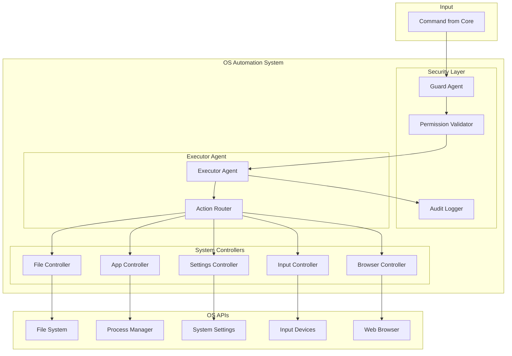

# Design Document: Dev OS Automation System

## Overview

The OS Automation System is the "Jarvis power" layer of Dev, providing Python-based system-level control over files, applications, system settings, keyboard/mouse input, and web browsers. It implements a secure, permission-based execution model with a Guard Agent that validates all actions before execution.

## Architecture



## Components and Interfaces

### 1. Guard Agent

Security gatekeeper that validates all actions before execution.

```python
from dataclasses import dataclass
from enum import Enum
from typing import List, Optional, Callable

class ActionSeverity(Enum):
    LOW = "low"           # Read-only operations
    MEDIUM = "medium"     # Modifications
    HIGH = "high"         # Destructive operations
    ELEVATED = "elevated" # System-level changes

@dataclass
class Permission:
    category: str  # file, app, system, input, web
    action: str    # read, write, delete, launch, etc.
    scope: str     # path pattern or "*"

@dataclass
class ValidationResult:
    allowed: bool
    requires_confirmation: bool
    requires_double_confirmation: bool
    missing_permissions: List[Permission]
    reason: Optional[str] = None

class GuardAgent:
    def __init__(self, user_permissions: List[Permission]):
        self.permissions = user_permissions
        self._confirmation_callback: Optional[Callable] = None
    
    def validate(self, action: 'Action') -> ValidationResult:
        """Validate action against user permissions."""
        pass
    
    def get_severity(self, action: 'Action') -> ActionSeverity:
        """Determine action severity level."""
        pass
    
    def request_confirmation(self, action: 'Action') -> bool:
        """Request user confirmation for elevated actions."""
        pass
    
    def explain_block(self, action: 'Action', result: ValidationResult) -> str:
        """Generate explanation for blocked action."""
        pass
```

### 2. Action Model

Represents a discrete OS operation.

```python
from dataclasses import dataclass, field
from typing import Any, Dict, Optional
from datetime import datetime
import json

@dataclass
class Action:
    id: str
    type: str  # file, app, system, input, web
    operation: str  # open, create, delete, launch, etc.
    parameters: Dict[str, Any]
    required_permissions: List[Permission]
    severity: ActionSeverity
    timestamp: datetime = field(default_factory=datetime.now)
    
    def to_json(self) -> str:
        """Serialize action to JSON."""
        return json.dumps({
            'id': self.id,
            'type': self.type,
            'operation': self.operation,
            'parameters': self.parameters,
            'severity': self.severity.value,
            'timestamp': self.timestamp.isoformat()
        })
    
    @classmethod
    def from_json(cls, json_str: str) -> 'Action':
        """Deserialize action from JSON."""
        pass

@dataclass
class ActionResult:
    action_id: str
    success: bool
    output: Any
    error: Optional[str] = None
    duration_ms: float = 0
```

### 3. File Controller

Handles file system operations.

```python
from dataclasses import dataclass
from typing import List, Optional
from pathlib import Path

@dataclass
class FileInfo:
    path: str
    name: str
    extension: str
    size_bytes: int
    is_directory: bool
    created_at: datetime
    modified_at: datetime

@dataclass
class SearchResult:
    files: List[FileInfo]
    total_count: int
    search_time_ms: float

class FileController:
    def open_file(self, path: str) -> ActionResult:
        """Open file in default application."""
        pass
    
    def create(self, path: str, is_directory: bool = False) -> ActionResult:
        """Create file or directory."""
        pass
    
    def copy(self, source: str, destination: str) -> ActionResult:
        """Copy file or directory."""
        pass
    
    def move(self, source: str, destination: str) -> ActionResult:
        """Move file or directory."""
        pass
    
    def delete(self, path: str, to_recycle_bin: bool = True) -> ActionResult:
        """Delete file (to recycle bin by default)."""
        pass
    
    def search(
        self, 
        query: str, 
        path: str = "~",
        by_name: bool = True,
        by_content: bool = False,
        file_types: Optional[List[str]] = None
    ) -> SearchResult:
        """Search for files matching criteria."""
        pass
    
    def get_info(self, path: str) -> FileInfo:
        """Get file/directory information."""
        pass
```

### 4. App Controller

Handles application lifecycle management.

```python
from dataclasses import dataclass
from typing import List, Optional

@dataclass
class AppInfo:
    pid: int
    name: str
    title: str
    path: str
    is_responding: bool

@dataclass
class AppMatch:
    apps: List[AppInfo]
    is_ambiguous: bool

class AppController:
    def launch(self, app_name_or_path: str) -> ActionResult:
        """Launch application by name or path."""
        pass
    
    def close(self, app_identifier: str, force: bool = False) -> ActionResult:
        """Close application gracefully or forcefully."""
        pass
    
    def focus(self, app_identifier: str) -> ActionResult:
        """Bring application window to foreground."""
        pass
    
    def list_running(self) -> List[AppInfo]:
        """List all running applications with windows."""
        pass
    
    def find_app(self, name: str) -> AppMatch:
        """Find application by name, detect ambiguity."""
        pass
    
    def get_focused_app(self) -> Optional[AppInfo]:
        """Get currently focused application."""
        pass
```

### 5. Settings Controller

Handles system settings adjustments.

```python
from dataclasses import dataclass
from typing import Optional

@dataclass
class SystemInfo:
    cpu_percent: float
    memory_percent: float
    disk_percent: float
    battery_percent: Optional[float]
    battery_charging: Optional[bool]

@dataclass
class NetworkStatus:
    wifi_enabled: bool
    wifi_connected: bool
    wifi_ssid: Optional[str]
    bluetooth_enabled: bool

class SettingsController:
    def set_volume(self, level: int) -> ActionResult:
        """Set system volume (0-100)."""
        pass
    
    def get_volume(self) -> int:
        """Get current system volume."""
        pass
    
    def set_brightness(self, level: int) -> ActionResult:
        """Set display brightness (0-100)."""
        pass
    
    def get_brightness(self) -> int:
        """Get current display brightness."""
        pass
    
    def toggle_wifi(self, enabled: bool) -> ActionResult:
        """Enable or disable Wi-Fi."""
        pass
    
    def toggle_bluetooth(self, enabled: bool) -> ActionResult:
        """Enable or disable Bluetooth."""
        pass
    
    def get_system_info(self) -> SystemInfo:
        """Get system resource information."""
        pass
    
    def get_network_status(self) -> NetworkStatus:
        """Get network connectivity status."""
        pass
```

### 6. Input Controller

Handles keyboard and mouse automation.

```python
from dataclasses import dataclass
from typing import List, Tuple, Optional

@dataclass
class InputConfig:
    delay_between_keys_ms: int = 50
    delay_between_actions_ms: int = 100
    mouse_move_duration_ms: int = 200

class InputController:
    def __init__(self, config: InputConfig):
        self.config = config
    
    def type_text(self, text: str, delay_ms: Optional[int] = None) -> ActionResult:
        """Type text at current cursor position."""
        pass
    
    def press_keys(self, keys: List[str]) -> ActionResult:
        """Press key combination (e.g., ['ctrl', 'c'])."""
        pass
    
    def hotkey(self, *keys: str) -> ActionResult:
        """Execute keyboard shortcut."""
        pass
    
    def move_mouse(self, x: int, y: int, duration_ms: Optional[int] = None) -> ActionResult:
        """Move mouse to coordinates."""
        pass
    
    def click(
        self, 
        x: Optional[int] = None, 
        y: Optional[int] = None,
        button: str = "left",
        clicks: int = 1
    ) -> ActionResult:
        """Perform mouse click."""
        pass
    
    def get_mouse_position(self) -> Tuple[int, int]:
        """Get current mouse position."""
        pass
    
    def scroll(self, amount: int, direction: str = "vertical") -> ActionResult:
        """Scroll mouse wheel."""
        pass
```

### 7. Browser Controller

Handles web browser automation.

```python
from dataclasses import dataclass
from typing import Optional, List

@dataclass
class PageState:
    url: str
    title: str
    is_loading: bool

@dataclass
class ElementSelector:
    selector_type: str  # css, xpath, id, name
    value: str

class BrowserController:
    def open_url(self, url: str) -> ActionResult:
        """Open URL in default browser."""
        pass
    
    def search(self, query: str, engine: str = "google") -> ActionResult:
        """Perform web search."""
        pass
    
    def navigate(self, action: str) -> ActionResult:
        """Navigate: back, forward, refresh."""
        pass
    
    def click_element(self, selector: ElementSelector) -> ActionResult:
        """Click element on page."""
        pass
    
    def fill_form(self, selector: ElementSelector, value: str) -> ActionResult:
        """Fill form field."""
        pass
    
    def get_page_state(self) -> PageState:
        """Get current page state."""
        pass
```

### 8. Audit Logger

Records all executed actions for security auditing.

```python
from dataclasses import dataclass
from typing import List, Optional
from datetime import datetime
import json

@dataclass
class AuditEntry:
    id: str
    action: Action
    result: ActionResult
    user_id: str
    timestamp: datetime
    
    def to_json(self) -> str:
        """Serialize audit entry to JSON."""
        pass
    
    @classmethod
    def from_json(cls, json_str: str) -> 'AuditEntry':
        """Deserialize audit entry from JSON."""
        pass

class AuditLogger:
    def log(self, action: Action, result: ActionResult, user_id: str) -> None:
        """Log executed action."""
        pass
    
    def query(
        self,
        user_id: Optional[str] = None,
        start_date: Optional[datetime] = None,
        end_date: Optional[datetime] = None,
        action_type: Optional[str] = None
    ) -> List[AuditEntry]:
        """Query audit log with filters."""
        pass
    
    def export_json(self, entries: List[AuditEntry]) -> str:
        """Export entries as JSON."""
        pass
```

## Data Models

### Permission Profile

```python
@dataclass
class PermissionProfile:
    user_id: str
    permissions: List[Permission]
    created_at: datetime
    updated_at: datetime
```

## Correctness Properties

*A property is a characteristic or behavior that should hold true across all valid executions of a system-essentially, a formal statement about what the system should do. Properties serve as the bridge between human-readable specifications and machine-verifiable correctness guarantees.*

### Property 1: File Creation Verification
*For any* valid file path, after a create operation, the file or directory SHALL exist at the specified path.
**Validates: Requirements 1.2**

### Property 2: File Copy Preservation
*For any* copy operation, after completion, both source and destination SHALL exist and have identical content.
**Validates: Requirements 1.3**

### Property 3: File Move Atomicity
*For any* move operation, after completion, the source SHALL NOT exist and the destination SHALL exist with the original content.
**Validates: Requirements 1.3**

### Property 4: Safe Delete to Recycle Bin
*For any* delete operation with to_recycle_bin=True, the file SHALL be moved to recycle bin and NOT permanently deleted.
**Validates: Requirements 1.4**

### Property 5: File Search Result Validity
*For any* file search query, all returned files SHALL match the specified search criteria (name pattern, type, or content).
**Validates: Requirements 1.5**

### Property 6: Application Listing Completeness
*For any* list_running call, the result SHALL include all applications with visible windows currently running on the system.
**Validates: Requirements 2.4**

### Property 7: Ambiguous App Name Detection
*For any* application name that matches multiple running applications, the find_app method SHALL return is_ambiguous=True with all matching apps.
**Validates: Requirements 2.5**

### Property 8: Volume Level Bounds
*For any* volume adjustment request, the system SHALL clamp the value to the range 0-100 and set the volume to that level.
**Validates: Requirements 3.1**

### Property 9: System Info Completeness
*For any* system info request, the result SHALL include CPU, memory, and disk percentages, plus battery info if available.
**Validates: Requirements 3.5**

### Property 10: Input Delay Enforcement
*For any* sequence of input actions, the system SHALL wait at least the configured delay between each action.
**Validates: Requirements 4.5**

### Property 11: Permission Validation Before Execution
*For any* action, the Guard Agent SHALL validate permissions BEFORE the action is executed, never after.
**Validates: Requirements 5.1**

### Property 12: Elevated Permission Confirmation
*For any* action with ELEVATED severity, the system SHALL request explicit user confirmation before execution.
**Validates: Requirements 5.2**

### Property 13: Destructive Action Double Confirmation
*For any* action classified as destructive (HIGH severity), the system SHALL require double confirmation before execution.
**Validates: Requirements 5.3**

### Property 14: Audit Log Completeness
*For any* executed action, an audit entry SHALL be created containing the action, result, user ID, and timestamp.
**Validates: Requirements 5.4**

### Property 15: Audit Log Serialization Round-Trip
*For any* AuditEntry, serializing to JSON and deserializing back SHALL produce an equivalent entry.
**Validates: Requirements 5.6**

### Property 16: Blocked Action Explanation
*For any* action blocked by the Guard Agent, the system SHALL provide an explanation including the missing permission and how to grant it.
**Validates: Requirements 5.5**

### Property 17: URL Validation for Browser
*For any* open_url request, the system SHALL validate the URL format before attempting to open.
**Validates: Requirements 6.1**

### Property 18: Browser Failure Reporting
*For any* failed browser automation, the error result SHALL include the current page state (URL, title).
**Validates: Requirements 6.5**

## Error Handling

| Error Type | Handling Strategy |
|------------|-------------------|
| File not found | Return error with path, suggest search |
| Permission denied (OS) | Return specific permission needed |
| Permission denied (Guard) | Explain missing permission, offer to request |
| App not found | Suggest similar app names |
| App not responding | Offer force close option |
| Invalid coordinates | Clamp to screen bounds |
| Browser timeout | Return partial state, suggest retry |
| Network unavailable | Return error for network-dependent operations |

## Testing Strategy

### Property-Based Testing Library
- **Python**: hypothesis

### Unit Tests
- Permission matching logic
- Action severity classification
- File path validation
- App name matching
- Input sequence generation

### Property-Based Tests
Each correctness property above will be implemented as a property-based test using hypothesis:
- Generate random valid inputs (file paths, app names, coordinates, permission sets)
- Verify the property holds across 100+ iterations
- Tag each test with: `**Feature: dev-os-automation, Property {N}: {description}**`

### Integration Tests
- End-to-end file operations
- Application lifecycle management
- System settings changes
- Input simulation sequences
- Browser automation flows
