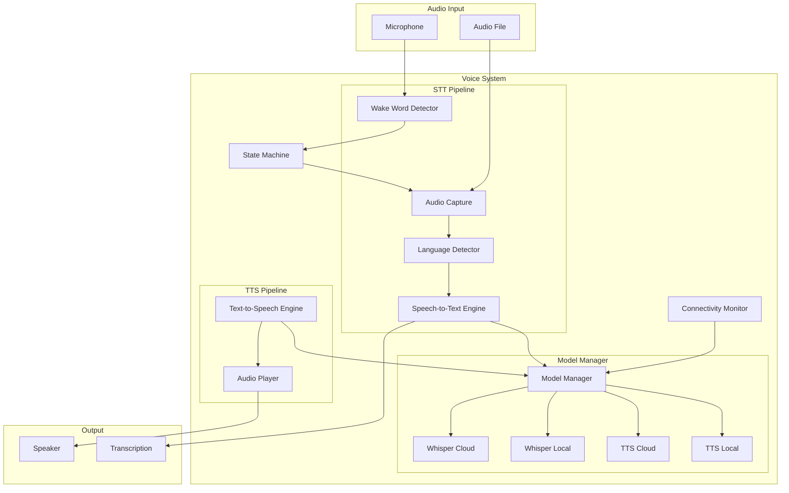

# Design Document: Dev Voice System

## Overview

The Voice System provides bilingual speech recognition (STT) and synthesis (TTS) capabilities for the Dev AI Assistant. It uses OpenAI Whisper for speech recognition with support for English, Hindi, and Hinglish, and pyttsx3/Coqui TTS for speech synthesis. The system supports wake word detection, automatic language detection, and seamless offline fallback.

## Architecture



## Components and Interfaces

### 1. Wake Word Detector

Lightweight always-on listener for wake word detection.

```python
from dataclasses import dataclass
from enum import Enum
from typing import Callable, Optional

class ListeningState(Enum):
    STANDBY = "standby"
    ACTIVE = "active"
    PROCESSING = "processing"

@dataclass
class WakeWordConfig:
    wake_word: str = "Hey Dev"
    sensitivity: float = 0.5
    timeout_seconds: float = 5.0

class WakeWordDetector:
    def __init__(self, config: WakeWordConfig):
        self.config = config
        self.state = ListeningState.STANDBY
        self._on_wake_callback: Optional[Callable] = None
    
    def start(self) -> None:
        """Start listening for wake word in background."""
        pass
    
    def stop(self) -> None:
        """Stop wake word detection."""
        pass
    
    def set_wake_word(self, wake_word: str) -> None:
        """Update the wake word."""
        pass
    
    def on_wake(self, callback: Callable) -> None:
        """Register callback for wake word detection."""
        pass
    
    def get_state(self) -> ListeningState:
        """Get current listening state."""
        return self.state
```

### 2. Audio Capture

Captures audio from microphone after wake word activation.

```python
from dataclasses import dataclass
from typing import Optional
import numpy as np

@dataclass
class AudioConfig:
    sample_rate: int = 16000
    channels: int = 1
    chunk_size: int = 1024
    max_duration_seconds: float = 30.0
    silence_threshold: float = 0.01
    silence_duration_seconds: float = 1.5

@dataclass
class AudioSegment:
    data: np.ndarray
    sample_rate: int
    duration_seconds: float
    is_valid: bool
    quality_score: float

class AudioCapture:
    def __init__(self, config: AudioConfig):
        self.config = config
    
    def capture(self, timeout_seconds: float = 10.0) -> AudioSegment:
        """Capture audio until silence or timeout."""
        pass
    
    def capture_stream(self) -> Iterator[np.ndarray]:
        """Stream audio chunks for real-time processing."""
        pass
    
    def validate_quality(self, audio: AudioSegment) -> bool:
        """Check if audio quality is sufficient for transcription."""
        pass
```

### 3. Language Detector

Detects primary language from audio or text.

```python
from dataclasses import dataclass
from enum import Enum
from typing import Optional

class Language(Enum):
    ENGLISH = "en"
    HINDI = "hi"
    HINGLISH = "hinglish"

@dataclass
class LanguageDetectionResult:
    language: Language
    confidence: float
    is_mixed: bool

class LanguageDetector:
    def __init__(self, default_language: Language = Language.ENGLISH):
        self.default_language = default_language
        self._override: Optional[Language] = None
    
    def detect_from_audio(self, audio: AudioSegment) -> LanguageDetectionResult:
        """Detect language from audio sample."""
        pass
    
    def detect_from_text(self, text: str) -> LanguageDetectionResult:
        """Detect language from text."""
        pass
    
    def set_override(self, language: Optional[Language]) -> None:
        """Set language override for session."""
        self._override = language
    
    def get_effective_language(self, detection: LanguageDetectionResult) -> Language:
        """Get language considering override and confidence threshold."""
        if self._override:
            return self._override
        if detection.confidence < 0.7:
            return self.default_language
        return detection.language
```

### 4. Speech-to-Text Engine

Transcribes audio to text using Whisper.

```python
from dataclasses import dataclass
from typing import Optional, List

@dataclass
class TranscriptionResult:
    text: str
    language: Language
    confidence: float
    segments: List['TranscriptionSegment']
    is_error: bool
    error_message: Optional[str] = None

@dataclass
class TranscriptionSegment:
    text: str
    start_time: float
    end_time: float
    confidence: float

class SpeechToTextEngine:
    def __init__(self, model_manager: 'ModelManager'):
        self.model_manager = model_manager
    
    def transcribe(
        self, 
        audio: AudioSegment, 
        language: Optional[Language] = None
    ) -> TranscriptionResult:
        """Transcribe audio to text."""
        pass
    
    def transcribe_stream(
        self, 
        audio_stream: Iterator[np.ndarray],
        language: Optional[Language] = None
    ) -> Iterator[TranscriptionResult]:
        """Stream transcription for real-time feedback."""
        pass
```

### 5. Text-to-Speech Engine

Synthesizes speech from text.

```python
from dataclasses import dataclass
from typing import Optional
import numpy as np

@dataclass
class TTSConfig:
    voice_id: str = "dev_default"
    speed: float = 1.0
    pitch: float = 1.0
    volume: float = 1.0

@dataclass
class SpeechOutput:
    audio_data: np.ndarray
    sample_rate: int
    duration_seconds: float

class TextToSpeechEngine:
    def __init__(self, model_manager: 'ModelManager', config: TTSConfig):
        self.model_manager = model_manager
        self.config = config
    
    def synthesize(self, text: str, language: Language) -> SpeechOutput:
        """Convert text to speech audio."""
        pass
    
    def get_voice_for_language(self, language: Language) -> str:
        """Get appropriate voice ID for language."""
        pass
```

### 6. Audio Player

Plays synthesized audio with interrupt support.

```python
from typing import Callable, Optional

class AudioPlayer:
    def __init__(self):
        self._is_playing: bool = False
        self._on_interrupt: Optional[Callable] = None
    
    def play(self, audio: SpeechOutput) -> None:
        """Play audio through default output device."""
        pass
    
    def stop(self) -> None:
        """Stop playback immediately."""
        pass
    
    def is_playing(self) -> bool:
        """Check if audio is currently playing."""
        return self._is_playing
    
    def on_interrupt(self, callback: Callable) -> None:
        """Register callback for playback interruption."""
        pass
```

### 7. Model Manager

Manages online/offline model switching.

```python
from dataclasses import dataclass
from enum import Enum
from typing import Optional

class ModelMode(Enum):
    ONLINE = "online"
    OFFLINE = "offline"

@dataclass
class ModelStatus:
    mode: ModelMode
    stt_model: str
    tts_model: str
    is_degraded: bool

class ModelManager:
    def __init__(self):
        self._mode = ModelMode.ONLINE
        self._connectivity_monitor: Optional['ConnectivityMonitor'] = None
    
    def get_stt_model(self) -> 'WhisperModel':
        """Get appropriate STT model based on connectivity."""
        pass
    
    def get_tts_model(self) -> 'TTSModel':
        """Get appropriate TTS model based on connectivity."""
        pass
    
    def get_status(self) -> ModelStatus:
        """Get current model status."""
        pass
    
    def set_connectivity_monitor(self, monitor: 'ConnectivityMonitor') -> None:
        """Set connectivity monitor for automatic switching."""
        pass
    
    def on_mode_change(self, callback: Callable[[ModelMode], None]) -> None:
        """Register callback for mode changes."""
        pass
```

### 8. Connectivity Monitor

Monitors internet connectivity for model switching.

```python
from typing import Callable, Optional

class ConnectivityMonitor:
    def __init__(self, check_interval_seconds: float = 5.0):
        self.check_interval = check_interval_seconds
        self._is_online: bool = True
        self._on_change: Optional[Callable[[bool], None]] = None
    
    def start(self) -> None:
        """Start monitoring connectivity."""
        pass
    
    def stop(self) -> None:
        """Stop monitoring."""
        pass
    
    def is_online(self) -> bool:
        """Check current connectivity status."""
        return self._is_online
    
    def on_connectivity_change(self, callback: Callable[[bool], None]) -> None:
        """Register callback for connectivity changes."""
        pass
```

## Data Models

### User Voice Preferences

```python
@dataclass
class VoicePreferences:
    user_id: str
    preferred_language: Language
    custom_wake_word: Optional[str]
    tts_voice_id: str
    tts_speed: float
    tts_volume: float
    updated_at: datetime
```

### Voice Session

```python
@dataclass
class VoiceSession:
    session_id: str
    user_id: str
    language_override: Optional[Language]
    started_at: datetime
    last_activity_at: datetime
    transcription_count: int
```

## Correctness Properties

*A property is a characteristic or behavior that should hold true across all valid executions of a system-essentially, a formal statement about what the system should do. Properties serve as the bridge between human-readable specifications and machine-verifiable correctness guarantees.*

### Property 1: Language-Based STT Model Routing
*For any* audio input with detected language (English or Hindi), the STT engine SHALL route to the corresponding language model for transcription.
**Validates: Requirements 1.2, 1.3**

### Property 2: Poor Audio Quality Error Handling
*For any* audio input with quality score below threshold, the system SHALL return an error result with is_error=True and appropriate error_message.
**Validates: Requirements 1.5**

### Property 3: Wake Word State Transition
*For any* detected wake word matching the configured wake word, the system SHALL transition from STANDBY to ACTIVE state.
**Validates: Requirements 2.2**

### Property 4: Silence Timeout State Transition
*For any* ACTIVE state with no speech detected for the configured timeout duration, the system SHALL transition back to STANDBY state.
**Validates: Requirements 2.4**

### Property 5: Custom Wake Word Configuration
*For any* custom wake word configuration, the wake word detector SHALL use the custom word instead of the default "Hey Dev".
**Validates: Requirements 2.5**

### Property 6: Language-Based TTS Voice Selection
*For any* text-to-speech request with specified language (English or Hindi), the TTS engine SHALL select the voice corresponding to that language.
**Validates: Requirements 3.2, 3.3**

### Property 7: Playback Interrupt Handling
*For any* interrupt signal received during audio playback, the player SHALL stop playback immediately and the system SHALL transition to listening state.
**Validates: Requirements 3.5**

### Property 8: Low Confidence Language Fallback
*For any* language detection result with confidence below 70%, the system SHALL use the user's preferred language setting instead of the detected language.
**Validates: Requirements 4.3**

### Property 9: Explicit Language Override
*For any* explicit language setting by user, the system SHALL use that language for all operations in the session, ignoring automatic detection.
**Validates: Requirements 4.4**

### Property 10: Language Preference Persistence Round-Trip
*For any* language preference update, storing and then retrieving the preference SHALL return the same language value.
**Validates: Requirements 4.5**

### Property 11: Offline Model Fallback
*For any* offline connectivity state, the system SHALL use local Whisper model for STT and local pyttsx3 for TTS.
**Validates: Requirements 5.1, 5.2**

### Property 12: Connectivity-Based Model Switching
*For any* connectivity state change (online to offline or vice versa), the model manager SHALL automatically switch to the appropriate models without requiring user action.
**Validates: Requirements 5.3, 5.5**

### Property 13: Offline Notification
*For any* transition to offline mode, the system SHALL generate a notification indicating reduced accuracy may occur.
**Validates: Requirements 5.4**

## Error Handling

| Error Type | Handling Strategy |
|------------|-------------------|
| Microphone unavailable | Return error, suggest checking permissions |
| Audio too short | Request user to speak longer |
| Audio too noisy | Request user to reduce background noise |
| Transcription failed | Retry once, then return error with suggestion |
| TTS synthesis failed | Fall back to text-only response |
| Model load failed | Fall back to alternative model |
| Playback device unavailable | Log error, continue with text response |

## Testing Strategy

### Property-Based Testing Library
- **Python**: hypothesis

### Unit Tests
- Audio quality validation thresholds
- Language detection confidence scoring
- State machine transitions
- Model selection logic

### Property-Based Tests
Each correctness property above will be implemented as a property-based test using hypothesis:
- Generate random valid inputs (audio configs, language settings, connectivity states)
- Verify the property holds across 100+ iterations
- Tag each test with: `**Feature: dev-voice-system, Property {N}: {description}**`

### Integration Tests
- End-to-end voice command flow
- Wake word detection accuracy
- Online/offline transition scenarios
- Multi-language transcription
