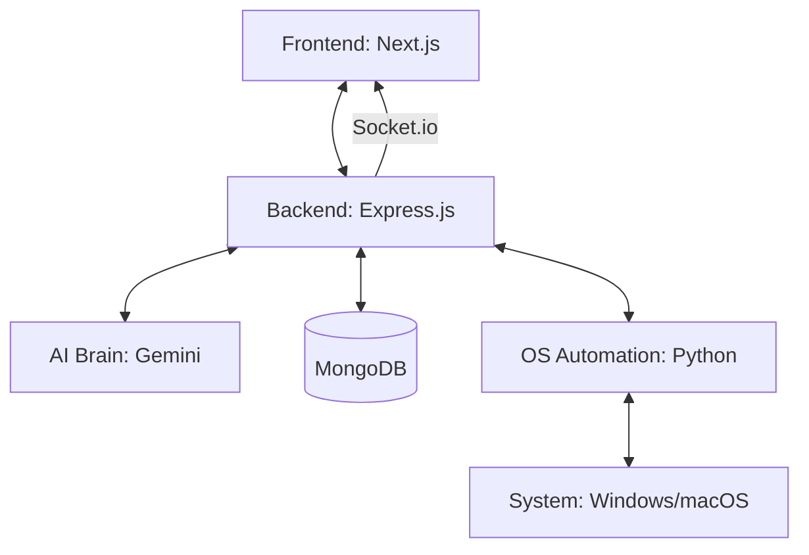

# DEV.OS - The Advanced AI Operating System Assistant


## 🚀 Overview
**DEV.OS** is a next-generation AI-powered Operating System assistant designed to bridge the gap between human intent and OS execution. Built with a modular microservices architecture, it leverages cutting-edge LLMs (Gemini) to automate desktop workflows, manage system settings, and integrate seamlessly with developer tools like GitHub.

---

## 🏗️ Architecture



### Component Breakdown
- **Frontend (`dev-frontend-ui`)**: A futuristic dashboard built with Next.js, featuring real-time system metrics and AI interaction.
- **Backend (`dev-auth-backend`)**: The central gateway handling authentication (Google/GitHub), command processing, and AI orchestration.
- **OS Automation (`dev-os-automation`)**: A localized Python microservice that executes low-level system commands (volume, brightness, power, file management).
- **AI Brain**: Integrated with Google's Gemini Flash for high-performance natural language understanding and recursive action triggering.

---

## 🛠️ Tech Stack
- **Languages**: TypeScript, JavaScript, Python
- **Frontend**: Next.js 14, React, Tailwind CSS, Framer Motion
- **Backend**: Node.js, Express, Socket.io
- **Database**: MongoDB Atlas (Mongoose)
- **AI**: Google Gemini AI
- **OS Layer**: FastAPI, PyAutoGUI, pywin32

---

## 📂 Project Structure
```text
.
├── apps/
│   ├── dev-frontend-ui/       # Next.js Frontend
│   ├── dev-auth-backend/      # Node.js Auth & API Gateway
│   ├── dev-os-automation/     # Python OS Execution Layer
│   ├── dev-voice-system/      # (Optional) Voice processing
│   └── dev-assistant-core/    # Shared logic & Interfaces
├── packages/                  # Shared utilities
└── env/                       # Python Virtual Environment
```

---

## 🚦 Getting Started

### Prerequisites
- Node.js (v18+)
- Python 3.10+
- MongoDB Atlas Account
- Google & GitHub OAuth Credentials

### Installation

1. **Clone the repository**
   ```bash
   git clone https://github.com/suvam-paul145/Dev-AI-OS-assistant.git
   cd Dev-AI-OS-assistant
   ```

2. **Setup Backend**
   ```bash
   cd apps/dev-auth-backend
   npm install
   # Create .env based on .env.example
   npm run dev
   ```

3. **Setup Frontend**
   ```bash
   cd apps/dev-frontend-ui
   npm install
   npm run dev
   ```

4. **Setup OS Automation**
   ```bash
   cd apps/dev-os-automation
   pip install -r requirements.txt
   python main.py
   ```

---

## 🛡️ Key Features
- **Intelligent Command Processing**: Natural interaction using LLMs.
- **Dynamic GitHub Sync**: Automatically push generated code to your repositories.
- **System Control**: Direct control over volume, brightness, power states, and application launching.
- **OAuth Integration**: Securely link Google and GitHub accounts.
- **Real-time Activity Feed**: Live updates of system actions via Socket.io.

---

## �️ Images & Badges
Below are **three** image options you can add to the README depending on what you want to showcase: quick status badges, static screenshots, or an animated demo GIF. Replace the placeholder paths/URLs with your real images or hosted links.

### Option A — Badges (Quick status)
Use shields.io style badges that reflect build, license, stars, or other metadata:

```markdown
[](https://github.com/Suvam-paul145/Dev-AI-OS-assistant/actions)
[](LICENSE)
[](https://github.com/Suvam-paul145/Dev-AI-OS-assistant/stargazers)
```

### Option B — Screenshots (Project visuals)
Add screenshots stored in the repo (recommended path: `docs/images/`). Example markup to show three side-by-side images:

```markdown
<p align="center">
  
  
  
</p>
```

### Option C — Animated Demo (GIF)
If you have a short demo, add an animated GIF (recommended: <5s, keep file size small):

```markdown

```

> Tips:
> - Create folders `docs/images/` and `docs/demo/` and commit the actual image/GIF files, or replace the `src` with hosted URLs (raw GitHub or external CDN).
> - Recommended screenshot resolution: 1280×720 (scale in markdown with `width`), GIF duration <5s and under ~5–10 MB for nicer GitHub rendering.

---

## �📄 License
This project is licensed under the MIT License - see the [LICENSE](LICENSE) file for details.

---

Developed with ❤️ by the **DEV.OS Team**.
